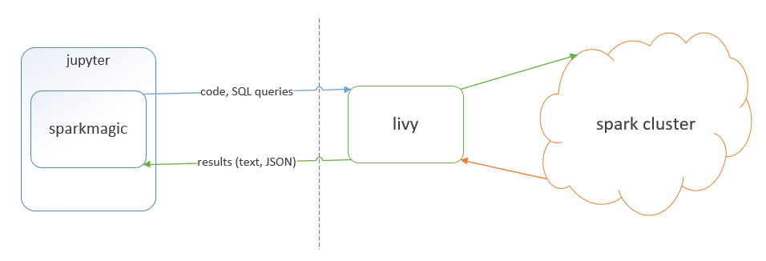

# sparkmagic

Sparkmagic is a set of tools for interactively working with remote Spark clusters through [Livy](https://github.com/cloudera/hue/tree/master/apps/spark/java), a Spark REST server, in [Jupyter](http://jupyter.org) notebooks.
The Sparkmagic project includes a set of magics for interactively running Spark code in multiple languages, as well as some kernels that you can use to turn Jupyter into an integrated Spark environment.


## Features

* Run Spark code in multiple languages against any remote Spark cluster through Livy
* Automatic SparkContext (`sc`) and HiveContext (`sqlContext`) creation
* Easily execute SparkSQL queries with the `%%sql` magic
* Automatic visualization of SQL queries in the PySpark and Spark kernels; use an easy visual interface to interactively construct visualizations, no code required
* Easy access to Spark application information and logs (`%%info` magic)
* Ability to capture the output of SQL queries as Pandas dataframes to interact with other Python libraries (e.g. matplotlib)

## Examples

There are two ways to use sparkmagic. Head over to the [examples](examples) section for a demonstration on how to use both models of execution.

### 1. Via the IPython kernel

The sparkmagic library provides a %%spark magic that you can use to easily run code against a remote Spark cluster from a normal IPython notebook. See the [Spark Magics on IPython sample notebook](examples/Magics in IPython Kernel.ipynb)

### 2. Via the PySpark and Spark kernels

The sparkmagic library also provides a set of Scala and Python kernels that allow you to automatically connect to a remote Spark cluster, run code and SQL queries, manage your Livy server and Spark job configuration, and generate automatic visualizations.
See [Pyspark](examples/Pyspark Kernel.ipynb) and [Spark](examples/Spark Kernel.ipynb) sample notebooks.

## Installation

1. Install the library

        `pip install sparkmagic`

2. Make sure that ipywidgets is properly installed by running

        `jupyter nbextension enable --py --sys-prefix widgetsnbextension` 
        
3. (Optional) Install the wrapper kernels. Do `pip show sparkmagic` and it will show the path where `sparkmagic` is installed at. `cd` to that location and do:

        `jupyter-kernelspec install sparkmagic/kernels/sparkkernel`
        `jupyter-kernelspec install sparkmagic/kernels/pysparkkernel`
        
4. (Optional) Modify the configuration file at ~/.sparkmagic/config.json. Look at the [example_config.json](sparkmagic/example_config.json)

5. (Optional) Enable the server extension so that clusters can be programatically changed:

        `jupyter serverextension enable --py sparkmagic`
        
### Server extension API

#### `/reconnectsparkmagic`:
* `POST`:
Allows to specify Spark cluster connection information to a notebook passing in the notebook path and cluster information.
Kernel will be started/restarted and connected to cluster specified.

Request Body example:
        ```
        {
                'path': 'path.ipynb',
                'username': 'username',
                'password': 'password',
                'endpoint': 'url'
        }
        ```

Returns `200` if successful; `404` if kernel for path is not found.

Reply Body example:
        ```
        {
                'success': true,
                'error': null
        }
        ```

## Architecture

Sparkmagic uses Livy, a REST server for Spark, to remotely execute all user code. 
The library then automatically collects the output of your code as plain text or a JSON document, displaying the results to you as formatted text or as a Pandas dataframe as appropriate.



This architecture offers us some important advantages:

1. Run Spark code completely remotely; no Spark components need to be installed on the Jupyter server

2. Multi-language support; the Python and Scala kernels are equally feature-rich, and adding support for more languages will be easy

3. Support for multiple endpoints; you can use a single notebook to start multiple Spark jobs in different languages and against different remote clusters

4. Easy integration with any Python library for data science or visualization, like Pandas or [Plotly](https://plot.ly/python/offline)

However, there are some important limitations to note:

1. Some overhead added by sending all code and output through Livy

2. Since all code is run on a remote driver through Livy, all structured data must be serialized to JSON and parsed by the Sparkmagic library so that it can be manipulated and visualized on the client side.
In practice this means that you must use Python for client-side data manipulation in `%%local` mode.

## Contributing

We welcome contributions from everyone. 
If you've made an improvement to our code, please send us a [pull request](https://github.com/jupyter-incubator/sparkmagic/pulls).

To dev install, execute the following:

        git clone https://github.com/jupyter-incubator/sparkmagic
        pip install -e hdijupyterutils 
        pip install -e autovizwidget
        pip install -e sparkmagic
        
and optionally follow steps 3 and 4 above.

To run unit tests, run:

        nosetests hdijupyterutils autovizwidget sparkmagic

If you want to see an enhancement made but don't have time to work on it yourself, feel free to submit an [issue](https://github.com/jupyter-incubator/sparkmagic/issues) for us to deal with.